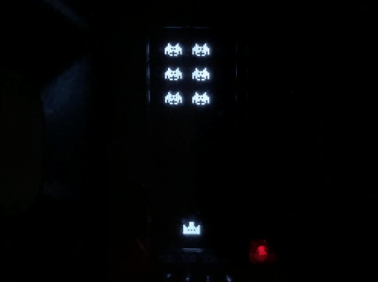
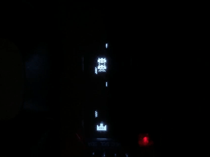
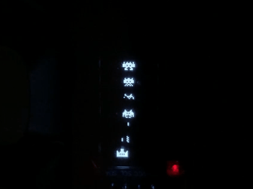

# About

A simple shooter game like Space Invaders that runs on **QMK Firmware**.

# What is it like?

# Player's Manual

- English: [ manual_en.md ](docs/manual_en.md)
- Japanese: [ manual_jp.md ](docs/manual_jp.md)

# Install/Build

1. Claw44 users
- English: [ guide_claw_en.md ](docs/guide_claw_en.md)
- Japanese: [ guide_claw_jp.md ](docs/guide_claw_jp.md)

2. Other keyboard users
- English: [ guide_other_en.md ](docs/guide_other_en.md)
- Japanese: [ guide_other_jp.md ](docs/guide_other_jp.md)

# How to draw with OLED fonts

- English: [ oled_fonts_en.md ](docs/oled_fonts_en.md)
- Japanese: [ oled_fonts_jp.md ](docs/oled_fonts_jp.md)
